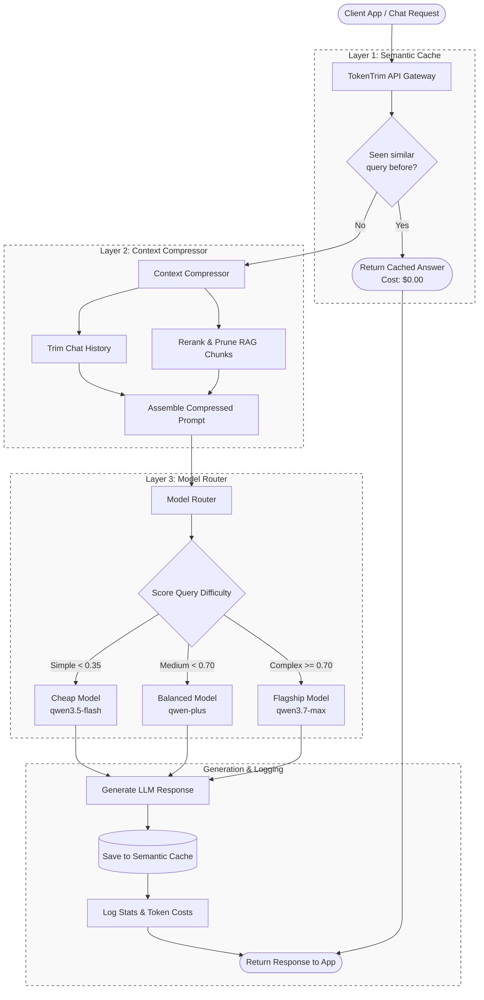

# TokenTrim Detailed Architecture & Flowchart

This document illustrates the step-by-step request flow through the TokenTrim Gateway and provides a detailed explanation of each individual component.

## System Flowchart

---

## Component Breakdown

### 1. Client App / Chat Request
The initial trigger is the client application (like a Chat UI) sending a POST request to the Gateway's `/chat` endpoint. This request contains the user's `query`, the conversational `history`, and optionally any retrieved documents or `rag_chunks` the app has fetched.

### 2. TokenTrim API Gateway
This is the FastAPI server (`app/main.py`) running the `Gateway` class. It serves as the orchestrator for the entire pipeline, routing the incoming request sequentially through the optimization layers. It handles dependency injection, deciding whether to connect to live Alibaba Cloud APIs and PostgreSQL, or fallback to offline mock clients.

### 3. Layer 1: Semantic Cache
**Goal:** Answer the question for free if a highly similar question has been asked before.
- **Seen similar query before?:** Instead of looking for an exact text match, the system converts the incoming query into a vector embedding (a mathematical fingerprint) using an embedding model (like `text-embedding-v4`). 
- **The Vector Search:** It checks a vector database (either `PgVectorStore` for Postgres or `InMemoryVectorStore` for local tests) to find the closest previously stored embedding using cosine similarity. If the similarity is above the configurable threshold (default `0.92`), it's a "cache hit."
- **Return Cached Answer:** The Gateway short-circuits, instantly returning the previous response for zero token cost and logging the massive savings. 

### 4. Layer 2: Context Compressor
**Goal:** Shrink the size of the request context to reduce input token usage without losing the core meaning.
- **Trim Chat History:** Replaying the entire chat history on every turn wastes tokens. This component verbatim-preserves only the last few conversation turns (e.g., the last 2). It compresses all older turns into a single, short summary string (e.g., max 400 characters).
- **Rerank & Prune RAG Chunks:** If the client app retrieved 10 external document chunks, they aren't all equally important. The compressor measures the embedding similarity between the specific query and each chunk, dropping the least relevant ones so you aren't paying for noise.
- **Assemble Compressed Prompt:** The prompt is carefully structured to maximize caching discounts on the LLM provider's end. Stable content (system prompts and RAG chunks) is placed at the top, while the volatile user query is placed at the bottom.

### 5. Layer 3: Model Router
**Goal:** Ensure expensive, flagship LLM models are only used for difficult questions. 
- **Score Query Difficulty:** Using a cheap, zero-token local heuristic function, the router scores the query from `0.0` to `1.0`. It increases the difficulty score for long sentences, deep chat histories, numerous RAG chunks, the presence of code syntax, or analytical keywords (like "compare", "debug", or "analyze").
- **Cheap Model (`qwen3.5-flash`):** Queries scoring below `0.35` are routed to the cheapest, fastest model tier, perfect for simple chit-chat.
- **Balanced Model (`qwen-plus`):** Queries scoring below `0.70` are routed to the medium-tier model for everyday reasoning tasks.
- **Flagship Model (`qwen3.7-max`):** Queries scoring `0.70` and above are routed to the most expensive model for complex, multi-step analysis.

### 6. Generation & Logging
**Goal:** Fetch the answer, persist the knowledge, and track the financial savings.
- **Generate LLM Response:** The compressed prompt is forwarded to the LLM tier selected by the Model Router.
- **Save to Semantic Cache:** Once the response is received, the original query, the response, and the query's vector embedding are saved into the Vector Database so future similar queries will trigger a cache hit in Layer 1.
- **Log Stats & Token Costs:** The Gateway calculates both the *actual cost* of the optimized call, and the *naive cost* (what it would have cost if the raw prompt had been blindly sent to the Flagship model). These metrics are appended to a JSONL log file, which powers the live frontend dashboard tracking the token savings.
- **Return Response to App:** The final generated response is returned to the client application.
