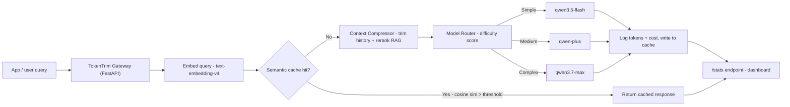

# TokenTrim — Build Guide
### Bano Qabil × Alibaba Cloud AI Hackathon 2026 — Token Optimization Track

**The pitch in one line:** TokenTrim is a drop-in optimization layer for Qwen-powered apps that cuts token spend through semantic caching, context compression, and difficulty-based model routing — with a live dashboard showing exactly how many real dollars it saved, computed off Alibaba's own current pricing, not invented numbers.

---

## 0. Why this build is aimed at *this* hackathon specifically

Bano Qabil (Alkhidmat Foundation's free skills-training program) and Alibaba Cloud built this as a nationwide competition, and organizers have been explicit that selected projects get put in front of investors, industry leaders, and international technology partners — a launchpad, not a finish line. That changes the judging bar from "does the demo run" to "could this plausibly become a real product."

Three things follow from that, and they shape every decision below:

1. **Every saved-dollar number must be independently checkable.** Judges (or an investor's engineer) can pull up Alibaba's own pricing page and verify your math in thirty seconds. If your numbers don't reconcile, the credibility of the whole pitch goes with it. Everything in the cost sections below is computed from Alibaba's live pricing page as of August 2026 — cite the same page in your deck.
2. **It should look like a product, not a script.** A gateway with a dashboard and a clear before/after story reads as something a team could sell tomorrow. A one-off optimization script doesn't.
3. **Staying inside the Qwen/Model Studio ecosystem is a scoring signal, not just a technical constraint.** Where you have a choice (embeddings, the cheap-tier model, etc.), TokenTrim uses Alibaba's own models rather than a third-party equivalent — it's a small thing that quietly tells judges you understood the assignment.

---

## 1. System Architecture

TokenTrim sits as a gateway between your app and Model Studio. Every request passes through three layers before — or instead of — hitting a model.



Two design decisions worth calling out to judges:

- **The semantic cache is not the same thing as Alibaba's own implicit prefix cache**, and the pitch is stronger if you say so explicitly. Model Studio's implicit cache only matches identical *prefixes* — it needs the beginning of two prompts to be byte-for-byte the same. TokenTrim's semantic cache catches *paraphrases* ("what are your hours" vs "when are you open") via embedding similarity, which prefix caching structurally cannot do. You get both: structure your prompts to be prefix-cache-friendly (stable content first) *and* run the semantic layer on top.
- **Batch mode never sits on the live request path** — it's 50% off but asynchronous, so it belongs in the indexing/backfill jobs (Section 8), not the `/chat` endpoint.

---

## 2. Tech stack

| Layer | Tool | Why |
|---|---|---|
| Gateway / API | **FastAPI** | Since you're already running FastAPI in production on The Brain, reusing it here means zero ramp-up time under hackathon pressure. |
| Vector store | **PostgreSQL + pgvector** | Same reasoning — you've already got this combo live for Phase 2 of The Brain. No new infra to learn or debug during the build window. |
| Embeddings | **Alibaba `text-embedding-v4`** via the OpenAI-compatible client | Keeps the entire stack inside the sponsor's ecosystem — same API key, same client object as your chat calls. |
| LLM calls | **OpenAI-compatible client** pointed at Model Studio | Alibaba's official recommended integration path; works with the standard `openai` Python package. |
| Dashboard | **FastAPI + Chart.js single page** for the MVP; React + Recharts as a stretch goal if time allows | Fastest path to a working, screenshot-able demo. |
| Async jobs | **Model Studio Batch API** (OpenAI-compatible) | For corpus indexing and any non-real-time re-embedding (Section 8). |

Suggested project layout:

```
tokentrim/
├── app/
│   ├── main.py              # FastAPI app, /chat and /stats routes
│   ├── config.py             # model IDs, pricing table, thresholds
│   ├── cache.py               # SemanticCache (Layer 1)
│   ├── compressor.py          # history + RAG compression (Layer 2)
│   ├── router.py              # difficulty scoring + model selection (Layer 3)
│   ├── qwen_client.py          # thin wrapper around the OpenAI-compatible client
│   └── stats.py                # request logging + cost aggregation
├── static/
│   └── dashboard.html          # Chart.js dashboard, reads from /stats
├── scripts/
│   └── batch_index_corpus.py    # one-off batch embedding job
├── requirements.txt
└── .env                          # DASHSCOPE_API_KEY, DATABASE_URL
```

---

## 3. Get Model Studio set up before writing anything else

1. Create an Alibaba Cloud account and activate **Model Studio**.
2. Pick the **Singapore (International)** region — it's the deployment scope that carries the 90-day free quota (1 million tokens per eligible model) and the pricing used throughout this guide.
3. Generate an API key and export it: `export DASHSCOPE_API_KEY="sk-xxx"`.
4. Install the SDK: `pip install -U openai`.
5. Sanity-check the connection:

```python
# scripts/hello_qwen.py
import os
from openai import OpenAI

client = OpenAI(
    api_key=os.getenv("DASHSCOPE_API_KEY"),
    base_url="https://dashscope-intl.aliyuncs.com/compatible-mode/v1",
)

completion = client.chat.completions.create(
    model="qwen-plus",
    messages=[
        {"role": "system", "content": "You are a helpful assistant."},
        {"role": "user", "content": "Who are you?"},
    ],
)
print(completion.choices[0].message.content)
```

If you're deploying from mainland China, swap the `base_url` for `https://dashscope.aliyuncs.com/compatible-mode/v1` — pricing differs by region, and this guide uses Singapore/international numbers throughout.

---

## 4. Layer 1 — Semantic Cache

**The idea:** before spending a single token on generation, check whether you've already answered something close enough to this question. Uses Alibaba's own `text-embedding-v4` so it's one client, one API key, no extra vendor.

```python
# app/cache.py
import os
import time
from dataclasses import dataclass
from openai import OpenAI
import psycopg2
from psycopg2.extras import RealDictCursor

client = OpenAI(
    api_key=os.getenv("DASHSCOPE_API_KEY"),
    base_url="https://dashscope-intl.aliyuncs.com/compatible-mode/v1",
)

EMBED_MODEL = "text-embedding-v4"
EMBED_DIM = 768  # 768 keeps pgvector index size and lookup cost down;
                  # text-embedding-v4 supports smaller dims for cost-sensitive setups

@dataclass
class CacheHit:
    response: str
    similarity: float
    original_query: str


class SemanticCache:
    def __init__(self, db_conn, similarity_threshold: float = 0.92):
        self.db = db_conn
        self.threshold = similarity_threshold

    def _embed(self, text: str) -> list[float]:
        resp = client.embeddings.create(
            model=EMBED_MODEL,
            input=[text],
            dimensions=EMBED_DIM,
        )
        return resp.data[0].embedding

    def lookup(self, query: str) -> CacheHit | None:
        vec = self._embed(query)
        with self.db.cursor(cursor_factory=RealDictCursor) as cur:
            # pgvector cosine distance: 0 = identical, 2 = opposite.
            # similarity = 1 - distance
            cur.execute(
                """
                SELECT query, response, 1 - (embedding <=> %s::vector) AS similarity
                FROM tokentrim_cache
                ORDER BY embedding <=> %s::vector
                LIMIT 1
                """,
                (vec, vec),
            )
            row = cur.fetchone()
        if row and row["similarity"] >= self.threshold:
            return CacheHit(
                response=row["response"],
                similarity=row["similarity"],
                original_query=row["query"],
            )
        return None

    def store(self, query: str, response: str) -> None:
        vec = self._embed(query)
        with self.db.cursor() as cur:
            cur.execute(
                """
                INSERT INTO tokentrim_cache (query, response, embedding, created_at)
                VALUES (%s, %s, %s::vector, %s)
                """,
                (query, response, vec, time.time()),
            )
        self.db.commit()
```

Table setup (run once):

```sql
CREATE EXTENSION IF NOT EXISTS vector;

CREATE TABLE tokentrim_cache (
    id SERIAL PRIMARY KEY,
    query TEXT NOT NULL,
    response TEXT NOT NULL,
    embedding VECTOR(768) NOT NULL,
    created_at DOUBLE PRECISION NOT NULL
);

-- IVFFlat index for fast approximate nearest-neighbor search once you have >1000 rows
CREATE INDEX ON tokentrim_cache USING ivfflat (embedding vector_cosine_ops) WITH (lists = 100);
```

**Threshold tuning tip for the demo:** 0.92 is a reasonable starting point, but pull up 5–10 real near-duplicate question pairs from your own test data and print their similarity scores before you lock the number in — it's the single easiest thing for a judge to poke at ("what if I ask it slightly differently?"), so make sure you've actually tested it, not just guessed it.

---

## 5. Layer 2 — Context Compressor

Two separate jobs live here: trimming chat history, and shrinking/reranking RAG context. Both run only on a cache miss.

```python
# app/compressor.py
from dataclasses import dataclass

@dataclass
class Message:
    role: str
    content: str

def compress_history(
    history: list[Message],
    keep_verbatim: int = 2,
    max_summary_chars: int = 400,
) -> list[Message]:
    """Keep the last N turns exactly as they were said; fold everything
    older into one short summary turn. For a hackathon MVP, a cheap
    extractive summary (join + truncate) is enough — an LLM-generated
    summary via qwen3.5-flash is the natural v2 upgrade (see Section 12)."""
    if len(history) <= keep_verbatim:
        return history

    older, recent = history[:-keep_verbatim], history[-keep_verbatim:]
    joined = " ".join(m.content for m in older)
    summary = joined[:max_summary_chars]
    if len(joined) > max_summary_chars:
        summary += "..."

    return [Message(role="system", content=f"Earlier conversation summary: {summary}")] + recent


def rerank_chunks(
    query_embedding: list[float],
    chunks: list[tuple[str, list[float]]],
    top_k: int = 2,
) -> list[str]:
    """Given (chunk_text, chunk_embedding) pairs already computed at
    index time, keep only the top_k most relevant to this specific
    query instead of stuffing every retrieved chunk into the prompt."""
    import numpy as np

    q = np.array(query_embedding)
    scored = []
    for text, emb in chunks:
        e = np.array(emb)
        sim = float(np.dot(q, e) / (np.linalg.norm(q) * np.linalg.norm(e)))
        scored.append((sim, text))

    scored.sort(key=lambda x: x[0], reverse=True)
    return [text for _, text in scored[:top_k]]


def build_prompt(system_prompt: str, compressed_history: list[Message], rag_chunks: list[str], query: str) -> list[dict]:
    """Structure matters for Alibaba's *implicit* prefix cache: put the
    stable content (system prompt, then RAG context) first and the
    unique, per-request content (the actual question) last. That's
    what makes repeated prefixes eligible for the automatic cache
    discount on top of everything TokenTrim does explicitly."""
    context_block = "\n\n".join(rag_chunks)
    messages = [{"role": "system", "content": f"{system_prompt}\n\nContext:\n{context_block}"}]
    messages += [{"role": m.role, "content": m.content} for m in compressed_history]
    messages.append({"role": "user", "content": query})
    return messages
```

---

## 6. Layer 3 — Model Router

Alibaba's own positioning for the three tiers is a useful, citable justification for this layer's design: **Max** for complex multi-step tasks, **Plus** as the balanced default for most scenarios, **Flash** for simple tasks needing fast, cheap responses. TokenTrim automates the decision that positioning implies.

```python
# app/router.py
from dataclasses import dataclass

# Prices in USD per 1,000,000 tokens — Alibaba Cloud Model Studio,
# Singapore/International, list prices as of August 2026.
# ALWAYS re-check https://www.alibabacloud.com/help/en/model-studio/model-pricing
# before your final demo — promotional discounts change frequently.
PRICING = {
    "qwen3.5-flash": {"input": 0.10, "output": 0.40},
    "qwen-plus":     {"input": 0.40, "output": 1.20},
    "qwen3.7-max":   {"input": 2.50, "output": 7.50},
}

@dataclass
class RoutingDecision:
    model: str
    reason: str

def score_difficulty(query: str, rag_chunk_count: int, history_len: int) -> float:
    """Cheap, instant, zero-token heuristic scorer for the MVP.
    Swap in a qwen3.5-flash classification call (Section 12) once
    you've got real usage data to validate thresholds against."""
    score = 0.0
    word_count = len(query.split())

    score += min(word_count / 40, 1.0) * 0.4          # longer questions skew harder
    score += min(rag_chunk_count / 5, 1.0) * 0.3        # more retrieved context skews harder
    score += min(history_len / 10, 1.0) * 0.1           # deep conversations skew harder

    hard_signals = ["compare", "analyze", "why", "explain step by step", "design", "debug"]
    if any(sig in query.lower() for sig in hard_signals):
        score += 0.2

    return min(score, 1.0)


def pick_model(query: str, rag_chunk_count: int, history_len: int) -> RoutingDecision:
    score = score_difficulty(query, rag_chunk_count, history_len)
    if score < 0.35:
        return RoutingDecision("qwen3.5-flash", f"difficulty={score:.2f} -> simple")
    elif score < 0.7:
        return RoutingDecision("qwen-plus", f"difficulty={score:.2f} -> medium")
    else:
        return RoutingDecision("qwen3.7-max", f"difficulty={score:.2f} -> complex")


def estimate_cost(model: str, input_tokens: int, output_tokens: int) -> float:
    p = PRICING[model]
    return (input_tokens * p["input"] + output_tokens * p["output"]) / 1_000_000
```

**Why start with heuristics instead of an LLM classifier:** it's free, instant, and has zero failure modes to debug live in front of judges. Section 12 covers upgrading to a `qwen3.5-flash`-based classifier once you have real traffic to tune it against — that's a legitimate "we know how to iterate on this" talking point for Q&A, not something you need working on day one.

---

## 7. Wiring it together: the gateway endpoint

```python
# app/main.py
import time
from fastapi import FastAPI
from pydantic import BaseModel
from openai import OpenAI
import os

from app.cache import SemanticCache
from app.compressor import compress_history, rerank_chunks, build_prompt, Message
from app.router import pick_model, estimate_cost, PRICING
from app.stats import log_request

app = FastAPI()
client = OpenAI(
    api_key=os.getenv("DASHSCOPE_API_KEY"),
    base_url="https://dashscope-intl.aliyuncs.com/compatible-mode/v1",
)

class ChatRequest(BaseModel):
    query: str
    history: list[dict] = []
    rag_chunks: list[str] = []

@app.post("/chat")
def chat(req: ChatRequest, cache: SemanticCache):
    t0 = time.time()

    # Layer 1: semantic cache
    hit = cache.lookup(req.query)
    if hit:
        log_request(cache_hit=True, model=None, input_tokens=0, output_tokens=0,
                     cost=0.0, latency=time.time() - t0)
        return {"response": hit.response, "cached": True, "similarity": hit.similarity}

    # Layer 2: context compression
    history = [Message(**m) for m in req.history]
    compressed_history = compress_history(history)
    # (rag_chunks assumed pre-scored/reranked upstream at retrieval time,
    #  or pass raw chunks + embeddings through rerank_chunks() here)
    messages = build_prompt(
        system_prompt="You are a helpful assistant.",
        compressed_history=compressed_history,
        rag_chunks=req.rag_chunks,
        query=req.query,
    )

    # Layer 3: model routing
    decision = pick_model(req.query, len(req.rag_chunks), len(req.history))

    completion = client.chat.completions.create(model=decision.model, messages=messages)
    usage = completion.usage
    cost = estimate_cost(decision.model, usage.prompt_tokens, usage.completion_tokens)
    cached_tokens = getattr(usage, "cached_tokens", 0)  # implicit-cache hits, if any

    response_text = completion.choices[0].message.content
    cache.store(req.query, response_text)

    log_request(
        cache_hit=False,
        model=decision.model,
        input_tokens=usage.prompt_tokens,
        output_tokens=usage.completion_tokens,
        cached_tokens=cached_tokens,
        cost=cost,
        latency=time.time() - t0,
        routing_reason=decision.reason,
    )

    return {
        "response": response_text,
        "cached": False,
        "model_used": decision.model,
        "routing_reason": decision.reason,
        "tokens": {"input": usage.prompt_tokens, "output": usage.completion_tokens},
        "cost_usd": round(cost, 6),
    }
```

---

## 8. Where batch mode fits

Batch calls are billed at **50% off both input and output tokens** — but they're asynchronous (submit a job, poll or wait for completion) and cannot be combined with context cache discounts on the same call. That makes them a poor fit for `/chat`, but a very good fit for anything that runs ahead of time:

- **Indexing your FAQ/knowledge base into pgvector** before the hackathon demo (embedding calls for the whole corpus at once).
- **Re-scoring your training data for the router's difficulty thresholds**, if you build the v2 classifier.
- **Nightly re-summarization of long-running conversation logs**, if your demo app has any.

```python
# scripts/batch_index_corpus.py
import os
from pathlib import Path
from openai import OpenAI

client = OpenAI(
    api_key=os.getenv("DASHSCOPE_API_KEY"),
    base_url="https://dashscope-intl.aliyuncs.com/compatible-mode/v1",
)

# test.jsonl: one JSON object per line, each shaped like a standard
# chat/embeddings request body, per the OpenAI Batch API spec.
file_object = client.files.create(file=Path("corpus_batch.jsonl"), purpose="batch")
print(file_object.model_dump_json())
# Next: client.batches.create(input_file_id=file_object.id, endpoint="/v1/embeddings", ...)
# then poll client.batches.retrieve(batch_id) until status == "completed".
```

Mention this layer explicitly in your pitch even if the live demo doesn't exercise it — it shows you understood that batch and cache are mutually exclusive levers for *different* workloads, which is a subtlety a lot of teams will miss.

---

## 9. The savings dashboard

This is the part that actually wins the room — a side-by-side, real-number comparison beats a slide full of claims every time.

### What to track

```python
# app/stats.py
import time
import json
from pathlib import Path

LOG_FILE = Path("tokentrim_stats.jsonl")

def log_request(**kwargs):
    kwargs["timestamp"] = time.time()
    with open(LOG_FILE, "a") as f:
        f.write(json.dumps(kwargs) + "\n")

def get_summary() -> dict:
    if not LOG_FILE.exists():
        return {"total_requests": 0}

    rows = [json.loads(line) for line in open(LOG_FILE)]
    total = len(rows)
    cache_hits = sum(1 for r in rows if r.get("cache_hit"))
    total_cost = sum(r.get("cost", 0) for r in rows)
    total_input_tokens = sum(r.get("input_tokens", 0) for r in rows)
    total_output_tokens = sum(r.get("output_tokens", 0) for r in rows)

    # Baseline: what it would have cost if every request had gone to
    # qwen3.7-max with zero compression or caching — the honest
    # "naive" comparison point for your before/after number.
    from app.router import PRICING
    naive_cost = sum(
        (r.get("input_tokens", 0) * 3 + r.get("output_tokens", 0))  # rough uncompressed estimate
        * PRICING["qwen3.7-max"]["input"] / 1_000_000
        for r in rows
    )

    return {
        "total_requests": total,
        "cache_hit_rate": round(cache_hits / total, 3) if total else 0,
        "total_cost_usd": round(total_cost, 4),
        "estimated_naive_cost_usd": round(naive_cost, 4),
        "estimated_savings_pct": round((1 - total_cost / naive_cost) * 100, 1) if naive_cost else 0,
        "avg_input_tokens": round(total_input_tokens / max(total - cache_hits, 1), 1),
    }
```

```python
# add to app/main.py
from app.stats import get_summary

@app.get("/stats")
def stats():
    return get_summary()
```

For the frontend, a single `static/dashboard.html` that fetches `/stats` every few seconds and renders two or three Chart.js bars (tokens before/after, cost before/after, cache hit rate) is enough for a hackathon demo — don't over-invest in the frontend when the backend numbers are the actual story.

### A worked example, with real August 2026 pricing

This is the exact comparison to put on a slide. All figures below use Alibaba Cloud Model Studio's Singapore/international **list prices** (verify live before you present — check the console for any active promo, since several tiers currently carry limited-time discounts on top of these):

| Model | Input ($/1M tok) | Output ($/1M tok) |
|---|---|---|
| qwen3.5-flash (cheap tier) | $0.10 | $0.40 |
| qwen-plus (mid tier) | $0.40 | $1.20 |
| qwen3.7-max (flagship) | $2.50 | $7.50 |

**Before TokenTrim** — a typical call with a full system prompt, 10 turns of raw chat history, and 5 unranked RAG chunks, defaulting to `qwen-plus` for every request regardless of complexity:

- Input: 8,200 tokens · Output: 300 tokens
- Cost: (8,200 × $0.40 + 300 × $1.20) ÷ 1,000,000 = **$0.00364 per call**

**After TokenTrim** — context compressor trims history + reranks RAG down to 3,100 input tokens; router classifies the question as simple and sends it to `qwen3.5-flash` instead:

- Input: 3,100 tokens · Output: 300 tokens
- Cost: (3,100 × $0.10 + 300 × $0.40) ÷ 1,000,000 = **$0.00043 per call**

**Result: 88.2% cost reduction — roughly 8.5x cheaper per call.** At 50,000 requests/day that's the difference between **≈$5,460/month and ≈$645/month** — a ≈$4,815/month saving, before counting a single semantic-cache hit. Every cache hit on top of that is close to free (just an embedding lookup), so a FAQ-heavy app with even a 15–20% hit rate compounds well past the 88% baseline.

Put the three numbers — before, after, percentage — directly on your dashboard in real time during the demo. That's the "this question used 8,200 tokens; optimized, it used 3,100" moment, except backed by a live cost figure instead of a token count alone.

---

## 10. Implementation timeline

Hackathon build windows vary, so map these four phases onto whatever calendar your organizers actually gave you rather than treating the day counts below as fixed:

1. **Foundation** — Model Studio account + API key working, Postgres/pgvector table created, `hello_qwen.py` returning a real response. Nothing clever yet, just plumbing that works.
2. **Core layers** — semantic cache, context compressor, and router built and unit-tested independently (each one should work in isolation before you wire them together). This is the highest-value phase; don't touch the dashboard until all three layers are solid.
3. **Gateway + dashboard** — the `/chat` and `/stats` endpoints, plus the Chart.js page. Get real before/after numbers flowing end-to-end.
4. **Polish + demo prep** — test the semantic cache threshold against real near-duplicate questions, rehearse the demo script (Section 11), and prepare the pitch deck with your dashboard screenshots and the worked cost example above.

---

## 11. Demo script for judges

1. **Open with the problem, not the tech.** "Most Qwen-powered apps burn tokens on things that don't need to be there — full chat history replayed every turn, RAG context that's mostly irrelevant, defaulting to the flagship model for simple questions."
2. **Live query #1 — a fresh, non-cached question.** Show it flow through the gateway; call out the token count and cost on screen.
3. **Live query #2 — a near-duplicate of #1, phrased differently.** Show the semantic cache catching it — instant response, near-zero cost. This is the moment that differentiates you from "just use the prefix cache," so don't rush it.
4. **Live query #3 — something genuinely complex.** Show the router correctly escalating to `qwen3.7-max` instead of underserving a hard question with the cheap tier. This proves the system isn't just "always pick cheap" — it's routing on actual difficulty.
5. **Show the dashboard.** Cumulative tokens saved, real dollars saved (computed live from the numbers above), cache hit rate.
6. **Close with the business case.** This isn't a hackathon toy — it's the kind of layer that could be a metered API or a small SaaS fee on top of token savings, which is exactly the kind of "investable" framing this hackathon is scouting for.

---

## 12. Stretch goals, roughly in order of effort-to-impact

- **LLM-based difficulty classifier** — replace the heuristic in Section 6 with a single cheap `qwen3.5-flash` call that returns a difficulty label. More robust, costs a small amount per request, worth it once you have real traffic to validate against.
- **Cross-encoder reranking** for RAG chunks instead of plain cosine similarity — meaningfully better relevance ordering for a modest latency cost.
- **Explicit context cache** for large, frequently-reused documents (e.g., a full product handbook) — Alibaba bills cache creation at 125% of the standard input rate but hits at a steep discount off that, so it pays for itself after a handful of reuses. Check the [Context Cache docs](https://www.alibabacloud.com/help/en/model-studio/context-cache) for the exact SDK calls when you're ready to add it — the guidance above focuses on implicit caching (zero setup) since that's the higher-value MVP target.
- **Per-app / multi-tenant dashboards** — if you frame TokenTrim as infrastructure other teams could plug into, showing it handling more than one "customer" strengthens the product narrative.
- **Streaming responses** through the gateway without losing the token accounting.
- **A drop-in SDK/proxy mode** so an existing Qwen app needs a one-line base-URL change to adopt TokenTrim, rather than a rewrite.

---

## 13. Submission checklist (adapt to your actual requirements)

- [ ] Working repo with a clear README (architecture diagram, setup steps, how to run the demo)
- [ ] The three layers demonstrably working independently, not just in one happy-path demo run
- [ ] Dashboard showing real, live-computed savings — not a static screenshot with made-up numbers
- [ ] A short pitch deck: problem → architecture → live numbers → business case
- [ ] Demo video as backup in case live internet/API access is flaky on presentation day
- [ ] Confirm your exact submission format and deadline directly with your Bano Qabil hackathon coordinators — the phase you're in now (post-selection, pre-final) is typically communicated directly to shortlisted teams rather than posted publicly, so treat anything above as a planning scaffold, not a substitute for your actual instructions.

---

## 14. Sources for anything you want to verify yourself

- Model pricing (the table in Section 6/9 above): https://www.alibabacloud.com/help/en/model-studio/model-pricing
- Context Cache mechanics: https://www.alibabacloud.com/help/en/model-studio/context-cache
- Batch API: https://www.alibabacloud.com/help/en/model-studio/batch-interfaces-compatible-with-openai/
- OpenAI-compatible chat setup: https://www.alibabacloud.com/help/en/model-studio/compatibility-of-openai-with-dashscope
- Text embedding API: https://www.alibabacloud.com/help/en/model-studio/embedding
- Hackathon launch coverage: https://alkhidmat.org/about-us/latest/blog/bano-qabil-alibaba-cloud-launch-ai-hackathon-2026

Good luck — this is a genuinely strong angle for a sponsor-aligned, investable-looking build. Go win it.
