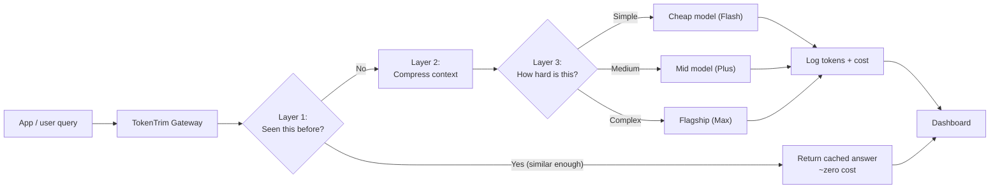

# TokenTrim — Project Explanation

*A plain-language companion to the build guide. This document explains **what** TokenTrim is and **why** each piece exists, without the code. If you want the step-by-step build instructions, see [TokenTrim_Hackathon_Build_Guide.md](TokenTrim_Hackathon_Build_Guide.md).*

---

## 1. What is TokenTrim, in one paragraph

TokenTrim is an **optimization layer that sits between an app and Alibaba's Qwen models** (via Model Studio) and cuts the cost of running that app. Large-language-model apps pay by the *token* — every word of the prompt and every word of the answer costs money. Most apps waste a lot of those tokens: they replay entire chat histories on every turn, stuff in retrieved documents that aren't relevant, and send simple questions to expensive flagship models that are overkill for the job. TokenTrim intercepts each request and removes that waste before it reaches a model, then shows — on a live dashboard, in real dollars — exactly how much it saved.

Think of it as a **smart filter on the pipe** between your app and the AI. The app doesn't change; the pipe just gets cheaper.

---

## 2. The problem it solves

When you build an app on top of an LLM, you're billed for two things on every single call:

- **Input tokens** — everything you send *to* the model (the system prompt, the conversation so far, any documents you attached, and the user's actual question).
- **Output tokens** — everything the model sends *back*.

Three habits quietly inflate that bill:

1. **Replaying history.** A chat app typically re-sends the *entire* conversation on every new message so the model "remembers" it. By turn 10, you're paying to send turns 1–9 again — every turn.
2. **Over-stuffing context (RAG).** Retrieval-augmented apps fetch chunks of documents to help the model answer. Grab five chunks when only two are relevant, and you pay for three chunks of noise on every call.
3. **Using a sledgehammer for everything.** "What are your opening hours?" and "Compare these three contracts and explain the legal risk" are wildly different in difficulty, but many apps send both to the same expensive top-tier model.

Individually these are small. At scale — tens of thousands of requests a day — they compound into a large, ongoing bill. TokenTrim attacks all three.

---

## 3. The core idea: a gateway with three layers

TokenTrim is a **gateway**. Every request the app makes passes through it, and inside the gateway there are three defensive layers. A request tries each layer in order, and the goal is to spend as few tokens as possible — ideally *zero*.

The order matters: **the cheapest outcome is checked first.** If Layer 1 can answer for free, the request never touches Layers 2 or 3 at all.

---

## 4. The three layers, explained

### Layer 1 — Semantic Cache ("Have I already answered this?")

Before spending a single token generating an answer, TokenTrim checks whether it has *already* answered a question close enough to this one. If yes, it returns the stored answer instantly and for near-zero cost.

The clever part is the word **semantic**. A naive cache only recognizes questions that are *identical, character for character*. TokenTrim instead converts each question into an **embedding** — a numerical fingerprint of its *meaning* — and compares fingerprints. That means it recognizes that:

> "What are your hours?" and "When are you open?"

are the same question, even though they don't share a single important word. When two fingerprints are similar enough (above a tuned threshold), it's treated as a cache hit.

**Why this is a genuine differentiator:** Alibaba's Model Studio already has a built-in "implicit cache," but that one only matches identical *prefixes* — the beginnings of two prompts must be byte-for-byte the same. It structurally *cannot* recognize paraphrases. TokenTrim's semantic layer catches exactly the cases the built-in cache misses. You use both together: the two are complementary, not competing.

### Layer 2 — Context Compressor ("Send less, keep the meaning")

If Layer 1 misses, the request must go to a model — but TokenTrim first shrinks it. Two jobs happen here:

- **Trim chat history.** Instead of replaying every past turn verbatim, it keeps the last couple of turns exactly as they were and folds everything older into a single short summary. The model still has context; it just costs a fraction as much to provide.
- **Rerank and prune RAG chunks.** Of all the document chunks retrieved for this question, it keeps only the handful most relevant to *this specific* query and drops the rest, rather than dumping all of them into the prompt.

There's also a subtle structuring trick: the stable, reusable content (system prompt, documents) is placed *first* in the prompt and the unique per-request content (the actual question) *last*. This ordering makes the prompt eligible for Alibaba's automatic prefix-cache discount — a free bonus saving on top of everything TokenTrim does explicitly.

### Layer 3 — Model Router ("Match the model to the difficulty")

Finally, TokenTrim decides *which* model should answer, because they cost very different amounts:

| Tier | Model | Best for | Relative cost |
|---|---|---|---|
| Cheap | Flash | Simple, fast questions | lowest |
| Balanced | Plus | Most everyday scenarios | mid |
| Flagship | Max | Complex, multi-step reasoning | highest |

The router scores each question's difficulty using a cheap, instant heuristic — things like how long the question is, how much context it needs, and whether it contains "hard" signal words like *compare, analyze, explain step by step, debug*. Simple questions go to the cheap model; genuinely hard ones are escalated to the flagship. This proves the system is smart, not just "always pick the cheapest" — it *upgrades* when a question deserves it, so quality doesn't suffer.

> This layer starts as a simple rule-based scorer on purpose: it's free, instant, and has nothing to break live in front of judges. A later version can replace it with a small LLM-based classifier once there's real traffic to tune against.

---

## 5. The savings story (the part that wins the room)

TokenTrim's whole pitch rests on **provable, real-dollar savings**, computed from Alibaba's own published pricing — not invented numbers. Here is the worked example the build guide centers on:

**Before TokenTrim** — a typical call: full system prompt, 10 turns of raw history, 5 unranked document chunks, all sent to the mid-tier model regardless of difficulty.
- ~8,200 input tokens + 300 output tokens
- **≈ $0.00364 per call**

**After TokenTrim** — the compressor trims the context down to ~3,100 input tokens, and the router recognizes this particular question as simple and sends it to the cheap model instead.
- ~3,100 input tokens + 300 output tokens
- **≈ $0.00043 per call**

**Result: ~88% cheaper per call — before a single cache hit is even counted.** At 50,000 requests/day that's roughly **$5,460/month down to ~$645/month**. Every semantic-cache hit on top of that is essentially free, so a FAQ-heavy app compounds the savings well past that 88% baseline.

A **live dashboard** displays three running numbers — cost before, cost after, and percentage saved — plus the cache hit rate, all updating in real time as questions flow through during the demo. The credibility rule throughout: any judge or investor's engineer can pull up Alibaba's pricing page and verify the math in thirty seconds.

---

## 6. A note on batch mode (a related, separate lever)

Alibaba also offers a **batch mode** billed at 50% off — but it's *asynchronous* (submit a job, wait for it to finish) and can't be combined with the cache discount. That makes it wrong for live chat, but ideal for work that runs *ahead of time*: indexing a whole FAQ/knowledge base into the vector store, nightly re-summarizing logs, or re-scoring training data. TokenTrim keeps batch mode strictly off the live request path and reserved for these background jobs. Understanding *why* batch and cache are levers for different workloads is a subtlety worth calling out in the pitch.

---

## 7. Technology, at a glance

| Piece | Choice |
|---|---|
| Gateway / API | FastAPI |
| Vector store (for cache + RAG) | PostgreSQL + pgvector |
| Embeddings (the "meaning fingerprints") | Alibaba `text-embedding-v4` |
| Model calls | OpenAI-compatible client pointed at Model Studio |
| Dashboard | FastAPI + Chart.js single page |
| Background jobs | Model Studio Batch API |

A deliberate theme: wherever there's a choice, TokenTrim uses **Alibaba's own models** (its embeddings, its cheap tier) rather than a third-party equivalent. Staying inside the sponsor's ecosystem is a scoring signal for this particular hackathon, not just a technical convenience.

---

## 8. Why this is framed as a product, not a script

This project was built for the **Bano Qabil × Alibaba Cloud AI Hackathon 2026**, where selected projects are put in front of investors and industry partners. That raises the bar from "does the demo run?" to "could this become a real business?" Three decisions follow from that framing:

1. **Every saved-dollar figure is independently checkable** against Alibaba's live pricing — credibility is the whole game.
2. **It looks like a product** — a gateway plus a dashboard with a clear before/after story — rather than a one-off optimization script.
3. **The business model is obvious:** TokenTrim could plausibly be sold as a metered API or a small SaaS fee taken on top of the token savings it delivers — precisely the "investable" shape the hackathon is scouting for.

---

## 9. The one-sentence summary

**TokenTrim is a drop-in gateway that makes Qwen-powered apps dramatically cheaper to run — by not answering questions twice (semantic cache), not sending more than necessary (context compression), and not overpaying for easy questions (model routing) — and it proves the savings live, in real dollars, on a dashboard.**
