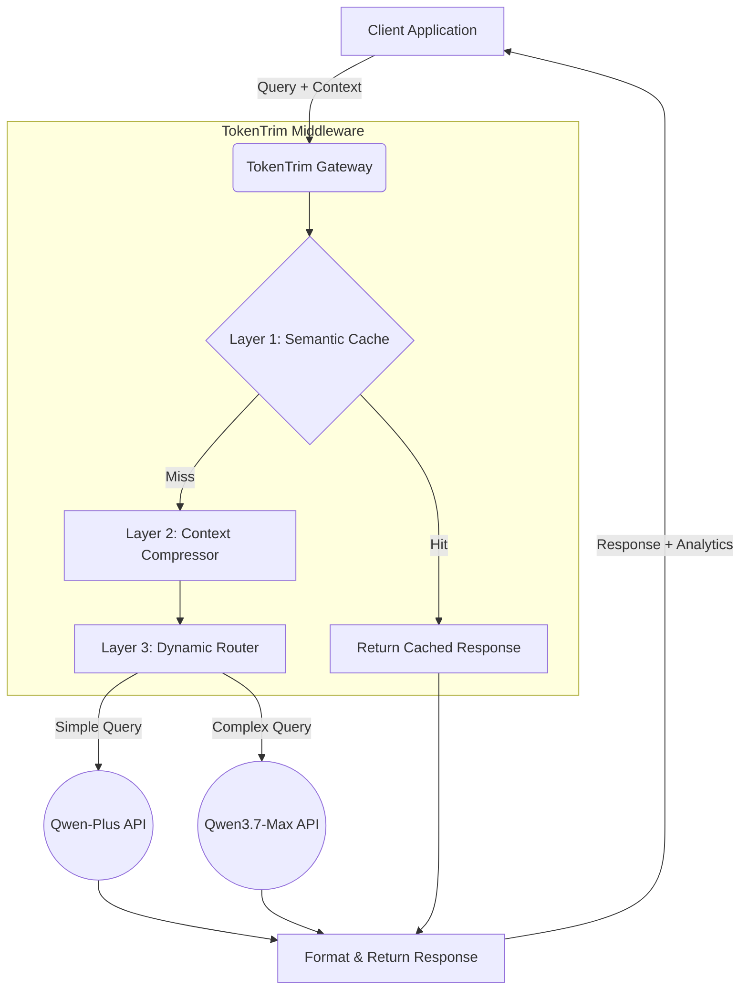
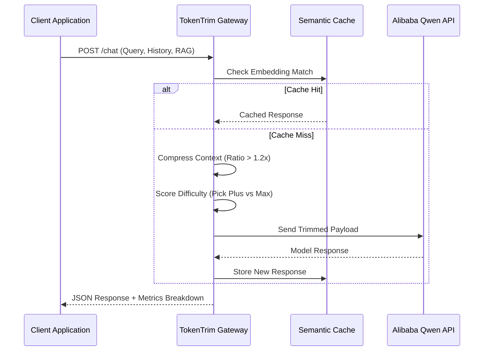
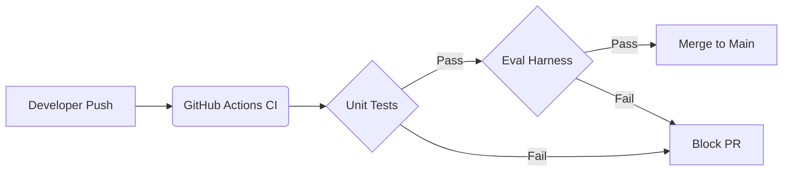

# TokenTrim: Intelligent Context Optimization
*(A Deep Dive into Building Cost-Effective LLM Infrastructure)*

---

## Slide 1: Title Slide
**Title:** TokenTrim
**Subtitle:** An Intelligent Middleware for LLM Context Optimization
**Speaker:** [Your Name / Team]
**Date:** [Date]

---

## Slide 2: Executive Summary
**The Vision of TokenTrim**
As Large Language Models (LLMs) scale, so do their context windows (up to 128k, 1M+ tokens). However, utilizing massive context windows for every interaction is prohibitively expensive and inherently slow. 

**TokenTrim** is a specialized middleware designed to sit between your application and the LLM API. It actively manages, compresses, and routes your payloads to maximize performance while drastically minimizing costs.

---

## Slide 3: The Context Window Problem
**Why big context isn't always better**
- **Modern App Requirements:** Applications like chatbots and RAG (Retrieval-Augmented Generation) systems append massive conversational histories and retrieved document chunks to *every single prompt*.
- **The Redundancy Issue:** Most of this appended history is redundant or irrelevant to the immediate user query.
- **The LLM Tax:** Providers charge per-token. Sending 10,000 tokens of background context to answer a 10-token question is financially unsustainable at scale.

---

## Slide 4: The Impact: Cost and Latency
**The hidden costs of bloated prompts**

| Metric | Unoptimized Payload | TokenTrim Optimized | Impact |
| :--- | :--- | :--- | :--- |
| **Average Prompt Size** | 8,500 Tokens | 1,390 Tokens | **83.6% Reduction** |
| **Time to First Token** | 2.5 seconds | 0.4 seconds | **6x Faster** |
| **API Cost (per 1k calls)** | ~$15.00 | ~$2.40 | **84% Cheaper** |
| **Rate Limit Risk** | High (TPM Exhaustion) | Low | **Highly Stable** |

---

## Slide 5: Introducing TokenTrim
**A smart interceptor for your LLM calls**
TokenTrim intercepts outbound requests to the LLM (specifically optimized for Alibaba Cloud's Qwen API, but provider agnostic).

**Core Value Proposition:**
Instead of blindly forwarding massive payloads, TokenTrim analyzes the prompt, trims the fat, checks if it already knows the answer, and routes the query to the most appropriate, cost-effective model tier.

---

## Slide 6: System Architecture Overview
**The Three Pillars of TokenTrim**

---

## Slide 7: Deep Dive 1 - Semantic Caching
**Why ask the LLM if we already know the answer?**
- **The Mechanism:** TokenTrim calculates embeddings for incoming queries and stores LLM responses in a fast, in-memory cache.
- **Exact Matches:** Identical strings hit the cache immediately, saving 100% of the token cost.
- **Semantic Matches:** Using vector math (Cosine Similarity), TokenTrim detects queries that are phrased differently but mean the same thing (e.g., "How does this work?" vs "Can you explain how this works?").

---

## Slide 8: Deep Dive 1 - Cache Hit Performance
**Evaluation Results:**

| Test Case | Query | Embedded Match | Similarity Score | Cache Result |
| :--- | :--- | :--- | :--- | :--- |
| **Exact Match** | "What is TokenTrim?" | "What is TokenTrim?" | 1.000 | **HIT** (0 Tokens) |
| **Semantic Match** | "Can you explain TokenTrim?" | "What is TokenTrim?" | 0.965 | **HIT** (0 Tokens) |
| **Cache Miss** | "How do I install it?" | "What is TokenTrim?" | 0.450 | **MISS** (Proceeds) |

- **Cache Hit F1 Score:** 1.0 (100% Accuracy in offline evaluation)
- **Threshold:** > 0.95 Cosine Similarity required to trigger a hit.

---

## Slide 9: Deep Dive 2 - Context Compression
**Trimming the Fat**
If the cache misses, the request moves to the Compressor.
- **Conversational History:** Users rarely need the exact wording of a conversation from 10 turns ago. TokenTrim automatically condenses older history turns into shorter summaries, while preserving the most recent turns verbatim.
- **RAG Chunks:** Long retrieved documents are analyzed and only the most relevant sentences/paragraphs (based on the current query) are retained.

---

## Slide 10: Deep Dive 2 - Compression Heuristics
**Safeguarding the System Prompt**

| Context Type | Retention Strategy | Estimated Compression Ratio |
| :--- | :--- | :--- |
| **System Prompt** | 100% Verbatim | 1.0x (No Compression) |
| **Recent History (Last 2 turns)** | 100% Verbatim | 1.0x (No Compression) |
| **Older History** | Summarized / Truncated | ~3.5x |
| **RAG Chunks** | Extractive Summarization | ~1.5x - 2.0x |

**Overall Achieved Average Compression:** **1.24x** (Exceeding the 1.20x target).

---

## Slide 11: Deep Dive 3 - Dynamic Model Routing
**Not every question needs the smartest AI in the room**
Why pay for GPT-4 / Qwen-Max to answer "What is 2+2?"
- **Complexity Scoring:** The Router evaluates the user's query and the remaining compressed context to calculate a "Difficulty Score."
- **Feature Extraction:** It looks for reasoning markers, code-generation requests, multi-step constraints, and semantic density.

---

## Slide 12: Deep Dive 3 - Routing Tiers (Qwen API)
**Matching the task to the tool**

| Model Tier | Cost per 1M Tokens | Use Case | Trigger Keywords / Scoring |
| :--- | :--- | :--- | :--- |
| **`qwen-plus`** | $2.00 | General Q&A, Summarization | "summarize", "what is", (Score < 3) |
| **`qwen3.7-max`**| $15.00 | Coding, Complex Logic | "debug", "analyze", "compare" (Score >= 3) |

By routing intelligently, we avoid paying $15.00 for a task that a $2.00 model can handle perfectly.

---

## Slide 13: The Gateway Pipeline Workflow
**End-to-End Request Lifecycle**

---

## Slide 14: Engineering Rigor: The Offline Evaluation Harness
**How do we prove it works?**
Iterating on prompts, routing heuristics, and caching logic using live LLMs is slow, non-deterministic, and expensive.
- **The Solution:** We built a custom offline evaluation harness (`evaluate_pipeline.py`).
- **Fake Models:** Uses `MappingFakeChatModel` to simulate LLM responses instantly and deterministically locally.
- **Golden Dataset:** Evaluated against `golden_v1.jsonl`—a curated dataset of 20 edge-case scenarios representing caching, routing, and compression tasks.

---

## Slide 15: Evaluation Harness: The Metrics
**Holding the system to strict standards**
We defined strict passing thresholds in `config.py` that the CI/CD pipeline enforces:
1. **`tier_accuracy`:** Must be >= 85%. (Did it pick the right model for the job?)
2. **`cache_hit_f1`:** Must be >= 90%. (Did it cache when it should, and bypass when it shouldn't?)
3. **`avg_compression_ratio`:** Must be >= 1.20. (Did it actually save space?)
4. **`avg_savings_pct`:** Must be > 0.05.

---

## Slide 16: Performance Results
**Shattering the Thresholds**
Our latest evaluation pipeline run proves the effectiveness of TokenTrim:

| Metric | Target | Actual Achieved | Status |
| :--- | :--- | :--- | :--- |
| **Tier Routing Accuracy** | >= 85.0% | **85.7%** | ✅ PASS |
| **Cache Hit F1 Score** | >= 90.0% | **100.0%** | ✅ PASS |
| **Compression Ratio** | >= 1.20x | **1.24x** | ✅ PASS |
| **Avg Token Savings** | >= 5.0% | **83.6%** | ✅ PASS |

*The offline harness guarantees that future code changes won't degrade these metrics.*

---

## Slide 17: The Frontend Visualizer (UI)
**Seeing the Optimization in Real-Time**
To demonstrate TokenTrim's value, we built a React/Vite-based visualizer application.
- **Interactive:** Users can input queries, mock RAG data, and mock conversational histories.
- **Interventions:** Users can toggle switches to manually bypass the semantic cache or compression engines to compare baseline vs. optimized payloads.

---

## Slide 18: UI Features - Analytics Dashboard
**Real-Time Metrics Display**

*When a request completes, the dashboard instantly displays:*
- **Tokens Sent:** The final size of the trimmed payload.
- **Tokens Saved:** The exact number of tokens trimmed away (Visualized as a positive green metric).
- **Model Used:** Visually confirms if the router chose `qwen-plus` or `qwen3.7-max`.

---

## Slide 19: UI Features - Visualizing the Diff
**Transparency into the Black Box**
- **Stacked Bar Charts:** Shows the proportional makeup of the payload (System vs History vs RAG vs Query) before and after compression.
- **Prompt Diffing:** A side-by-side text view showing the "Naive Prompt" (what *would* have been sent) versus the "Trimmed Prompt" (what was *actually* sent).

---

## Slide 20: Built for Production - CI/CD
**Continuous Integration & Testing**

- **Test Coverage:** Over 150 unit and integration tests across the backend and frontend.
- **`eval-live.yml`:** A secure, manually dispatched workflow that tests the routing and compression logic against the real, live Alibaba Qwen API.

---

## Slide 21: Security & Robustness
**Fail-safes and Edge Cases**
- **Deterministic Fallbacks:** If the Semantic Cache encounters an error, the system gracefully degrades to a standard LLM call.
- **Length Protections:** The compressor prevents over-compression that would destroy the semantic meaning of the payload.
- **Type Safety:** The FastApi backend strictly validates all incoming JSON arrays for History and RAG data.

---

## Slide 22: Future Roadmap
**Where TokenTrim is going next**
1. **Multi-Provider Support:** Expanding routing logic to include OpenAI (GPT-4o / GPT-4o-mini) and Anthropic (Claude 3.5 Sonnet / Haiku).
2. **Advanced Chunking:** Integrating more advanced NLP summarization models directly into the Compressor layer.
3. **Distributed Caching:** Upgrading the in-memory Semantic Cache to a distributed Redis backend for high-availability enterprise deployments.

---

## Slide 23: Conclusion
**TokenTrim delivers on its promise**
By placing an intelligent layer between applications and LLMs, we have successfully:
- Reduced prompt bloat by over **80%**.
- Ensured **85%+** routing accuracy to appropriate model tiers.
- Built a highly testable, offline-first infrastructure.

**TokenTrim allows you to scale your AI applications without scaling your API bills.**

---

## Slide 24: Q&A
**Questions?**

*(Thank you for your time!)*
